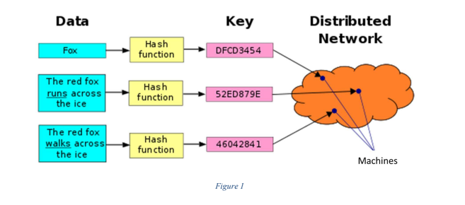
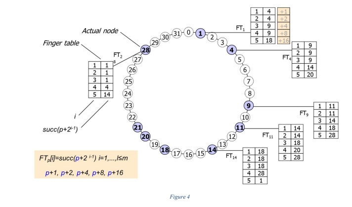
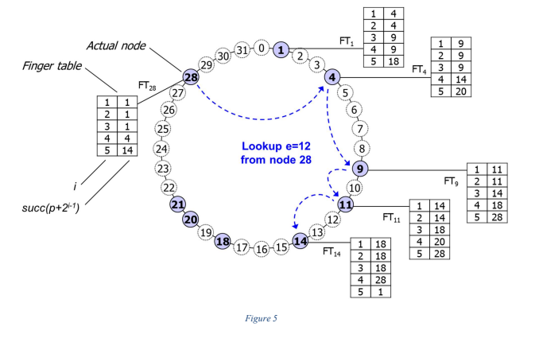

<h1>Distributed_Hash_Table</h1>

In it, I have implemented an Hashing Algorithm for Storing and efficiently retrieving the data in an Distributed Network System. In practical, the data is not located on a single machine but rather stored on multiple machines geo-distributed across the Internet. In such a scenario, searching or retrieval of data
is very challenging, as it is hard to determine on which machine the required data is stored. The data structures used for efficiently search data stored on a single machine such as hash tables cannot be directly employed in a distributed environment. The Figure below shows the concept of data storage and lookup in a distributed environment.

Typically, data is stored as a key, value pair. For example, key might be the name of the student or the student ID and value is the complete information about the student. Likewise, the key can be the name of the patient and value can be the medical record. Similarly, the key can be the name of an image file and value represents the file itself.

A distributed hash table (DHT) provides a lookup (or search) service similar to a hash table: (key, value) pairs are stored in a DHT and any participating machine can efficiently retrieve the value associated with a given key. Responsibility for maintaining the mapping from keys to values is distributed among the machines. In particular

<ul>
  <li>Hash function such as SHA-1 is used to map key to identifier space. For example, in Figure 2 a key is mapped to an id e1 in the identifier space. Another key is mapped to the id e2 and so on.</li>
  <li>Machines are also mapped into identifier space using the hash function on their addresses such as IP address.</li>
  <li>Each machine is responsible for a range of ids in the identifier space. For example, Figure 2 depicts that machine 1 is responsible for storing the data (i.e., key, value pairs) whose keys are mapped to e1 and e2. Likewise, machine 3 is responsible for the ids e4 and e5.</li>
  <li>When a machine leaves, its id range is merged with a neighbor’s range. </li>
  <li>Likewise, when a new machine joins, the id range of neighbor is subdivided.</li>
</ul>
<strong>In order to achieve the above explained sanario, following thing have been implemented in the Algorithm</strong>
<h2>The Distributed Hash Table (DHT)</h2>
The Data is stored in the form of “Key – Value Pairs” (much like a Dictionary), and these Keys are re-used to access the already stored data.The Distributed Hash Table, or DHT for short, is a Circular Linked List that contains “Amount of Machines”, “Total Bit Space” and every single Node of the List has.

<ol>
  <li>An ID</li>
  <li>A Finger Table (Routing Table) Object </li>
  <li>An AVL Tree Object</li>
   <li>Address of the next machine of the linked list.</li>
</ol>
<h3>The finger Table</h3>

  The Finger Table is used to access shortcuts between the machines in order to Insert and Access Data.
The Routing table contains:
  <ol>
    <li>A head and tail node of the Singly Linked List.</li>
     <li>These Nodes contain a DHT Node and a pointer to the next entry of the linked list.</li>
   </ol>

<h3>The AVL Tree</h3>

The AVL Tree is the primary place of “Key Data Storage”, as in it stores the Keys, and the relevant information of where the Data is stored. Data is entered into the AVL Tree in Key – Value pairs, and the tree is then “Balanced”. Behind the scene in AVL, the data is stored in file system. For each machine there is different set of files. Each machine generate a new file if a data in one exceed a specified number. In this implementation, we restrict the number to 100. which mean a new file is created each data the record in the file exceed 100 line.  
 AVL Tree contains:

   <ol>
     <li>A Line Count (For different Files)</li>
     <li>A Root Node – This contains:</li>
      <ul>
         <li>File Name (Of where data is stored)</li>
         <li>Line Number (Of the file, where data is stored)</li>
         <li>Key </li>
         <li>Left and Right branch nodes</li>
      </ul>
  </ol>
 <h2>The Search Algorithm</h2>
 
The request to search a data, i.e., given a key search for the value, can arrive on any machine. The
machine will first determine whether the data is locally stored, i.e., id e of the data is less than or equal
to the id p of the machine (p ≥ e). If data is not locally found, the search request is forwarded to the
next node in the circular linked list and so on. This very simple search algorithm is not very efficient
with a complexity of O(N) where N is the number of machines in the distributed system. Why?
To efficiently resolve data identifier e to machine succ(e), each machine p contains routing table FTp
of at most O(log N) entries, where N is the number of machines in the distributed system. Each
routing table entry i contains the shortcut/pointer to the distant node, i.e., FTp[i]=succ(p + 2i-1),
where i=1,...,l≤log(N). Figure 4 shows a 5-bit identifier space. The FT of machine 1 includes
the links (also called shortcuts or pointers) to the machines who are responsible, i.e., succ, for the ids
(1+1), (1+2), (1+4), (1+8), (1+16).
Note: Figure 4 depicts the routing tables of machines with ids 1, 4, 9, 11, 14 and 28. Try to construct
these routing tables by hand to properly understand the concept of shortcuts.

Given the properly maintained routing tables, the search query will be routed as follows:
  <ul>
   <li> A machine p receives a key, i.e., H(key) = e and starts the process to search for the corresponding value.</li>
   <li> Machine p receiving search(e) considers following cases:</li>
     <ol>
        <li>   p=e, i.e. value is stored on the same machine. Use AVL search to find the data and return the results.</li>
        <li>  p < e and e ≤ FTp [1]. In this case, the search request is forwarded to the machine FTp[1], i.e., first entry of routing table entry.</li>
        <li>  FTp[j] < e ≤ FTp[ j+1]. In this case the search request is forwarded to the machine FTp[j].</li>
     </ol>
  </ul>

The above search algorithm using routing table will result in O(log N) lookups, where N is the number of machines in the system.Figure 5 shows the working of above algorithm, where the search query for a data with H(key) = 12 is originated at node 28.

